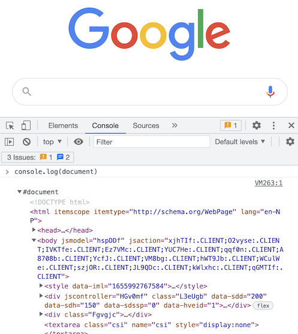

# DOM

### Introduction

It's time to learn the DOM (Document Object Model). This section is focused on teaching the basics of the concepts needed for the Guessing Game project. It is designed to be a light introduction to provide you exposure to using JavaScript with the DOM. The Immersive will dive deeper into HTML, CSS, and using JavaScript in the DOM (and server sided as well).

## What is the DOM?

DOM stands for Document Object Model. Let's break it down!

Here is a visual of the DOM:


Let's discuss each part of the DOM:

- **Document** - the document is just a file, in most cases when talking about the DOM it is an HTML file
- **Object** - every HTML element in the "document" is an object, e.g.:

```html
<html lang="en">
  <head>
    <meta charset="UTF-8" />
    <title>My First HTML Page</title>
  </head>

  <body>
    <h1>I am an object</h1>
  </body>
</html>
```

everything is an "object" including the `<html>`, `<head>`, `<body>`, elements, everything in the HTML document above is an object!

- **Model** - model represents the positioning and layout of the elements on the page. This is where the family-tree terminology is applied which was introduced in HTML and CSS.

## HOW DO YOU ACCESS THE DOM?

Let's inspect the document object in the browser. Here is a screenshot of logging a global object called "document", this is the interface to interact with DOM in your browser:



This is the document object from google.com. The document object has its own API that allows us to interact with all the element objects in the DOM. For example, in the screenshot below, we accessed the property body to review all the content in the body element. The syntax used is dot notation (property accessor) but you could have also used bracket notation because document is just another ordinary object in the browser.


## Selecting DOM Elements

Let's continue exploring how we can interact with the DOM and look at element "selectors". Selectors are methods on the document object that return an object (element) in the DOM or a list of elements in the DOM. Here are some popular selectors:

- [document.getElementById('name-of-id')](https://developer.mozilla.org/en-US/docs/Web/API/Document/getElementById)
- [document.getElementsByTagName('p')](https://developer.mozilla.org/en-US/docs/Web/API/Document/getElementsByTagName)
- [document.getElementsByClassName('my-class')](https://developer.mozilla.org/en-US/docs/Web/API/Document/getElementsByClassName)
- [document.querySelector('.myClass')](https://developer.mozilla.org/en-US/docs/Web/API/Document/getElementsByClassName)

When using a new method, it should be your first instinct to check the documentation for the method to see how it works! Answer the questions:

- What can I call it on? --> the document object
- Does it accept arguments? --> yes, the name of an ID attribute
- What does it return? It returns an [element](https://developer.mozilla.org/en-US/docs/Web/API/Element) object.

Every method selector either returns one element or a list of elements, review their documentation. Here is an example of using the querySelector method. [This example](https://codepen.io/rushilshakya/pen/PoQrMyg) uses console.log to log the outputs, visit the [Codepen link](https://codepen.io/rushilshakya/pen/PoQrMyg) and run the code in Codepen. You can also open your browser's console on this page, and you will see the log statements.

## Manipulating DOM Elements

### Introduction to Event Listeners

When your HTML loads in the browser, it loads top to bottom.

- the `<head>` element loads first that includes the stylesheets (CSS) for the page
- the `<body>` element loads, and all of the HTML elements in the `<body>` are added to the DOM
- at the end of the body, `<script>` tags load all the javascript files

Since the `<script>` element loads only one time, the javascript files execute once. If we have code that is executed in the js file, it only runs once. In order to run code based on a user action, such as a button click, keyboard event, form submission, etc. For example visit [this codepen example](https://codepen.io/rushilshakya/pen/KKQOPry)

In the example, the [HTMLElement](https://developer.mozilla.org/en-US/docs/Web/API/HTMLElement)'s [style](https://developer.mozilla.org/en-US/docs/Web/API/HTMLElement/style) property is used to update the background color of the `<p>` element. The js code executes when the `<script>` element loads. If we wanted the background color to be red, we could have made the background color in our CSS file. How can we have the updateTheColor function execute after our document is done loading? For example, let's say we wanted the background color to change to red when a user clicked the page. In order to achieve this behavior, we need to look at events and event handlers.

### INTRO TO EVENTS

An event is just an action that happens in your program or on your web page. This allows your program to run a block of code when "some event" happens. Review the two videos below to see how to add a "listener" to the DOM that "listens" for a specific event.

[](https://youtu.be/6tGf7xrLqEY)

[](https://youtu.be/h3U3ycLEWQA)

Now, go to [this codepen link](https://codepen.io/rushilshakya/pen/KKQOKze) to complete the coding challenge

For more details - you can read about [DOM at MDN](https://developer.mozilla.org/en-US/docs/Web/API/Document_Object_Model/Introduction)
