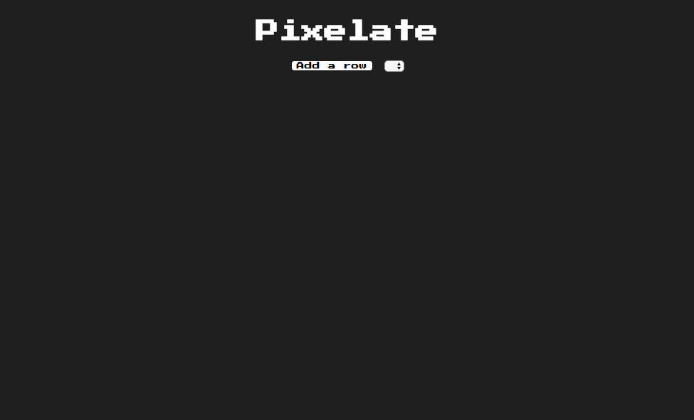
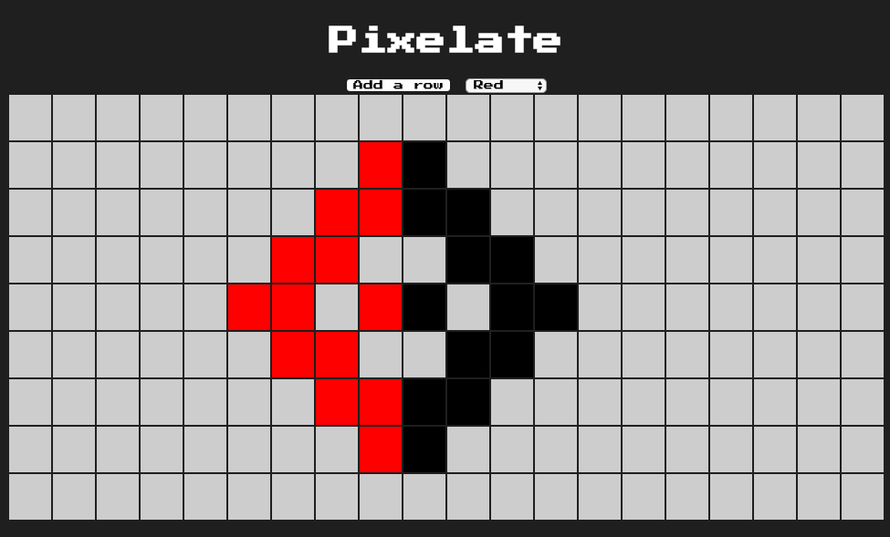

# Pixelate

Today, we'll be building a small editor for making 8-bit art! You'll be able to re-create characters from all your favorite classic video games! Oh, and you'll also practice event handling and delegation, DOM manipulation, and some basic CSS.

## STARTING POINT



## ENDING POINT



## Familiarize Yourself With Starting Point

Take a moment to examine the starting point. The most important file to check out is index.html - it contains HTML that our browser will use to construct the DOM, as well as link and script tags that cause the browser to request additional resources (we'll learn more about this process in the coming days).

In this exercise, you will work primarily out of index.html, style.css, and script.js. Take a moment to read through these files and see how their starting content relates to what you see when you navigate in your browser.

Note: To start this project, you can either run the `Live Server` extension in your VSCode, or run npm install, followed by npm start, which will start a small http server for the project (look at package.json to see which npm library is being used).

## Styling Table Cells

Our first task will be to get our grid of cells to appear.

An HTML table has three basic ingredients - the `<table>` tag, which contains a series of table rows (`<tr>`) as children, which in turn contain a series of table data cells (`<td>`). (There are other some others, but we won't worry too much about them today).

- In `index.html`, add the following HTML between the opening and closing `<table>` tags

```html
<tr>
  <td></td>
  <td></td>
  <td></td>
</tr>
<tr>
  <td></td>
  <td></td>
  <td></td>
</tr>
```

If you refresh the page, you won't actually see any difference - this is because our `td` cells don't have any `style`! If you refer back to our goal, you'll see that what we want is for each `td` to have a light gray background color with dimensions of about 50x50 pixels.

- Add a CSS rule to `style.css` that will make each td look the way we want. You'll know you've succeeded if you see something like this:

  

<details><summary>To see hint: click to expand</summary>

```css
td {
  height: 50px;
  width: 50px;
  background-color: lightgray;
}
```

</details>

## Creating Elements

Creating a new DOM element with JavaScript is a two step process:

First, you must create the new element using document.createElement
Second, you must append the element to its parent using parentElement.appendChild(newElement)
For example, to add a new li to a ul, we might do something like this:
